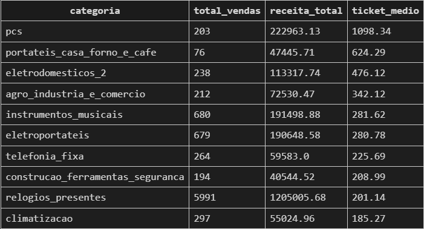
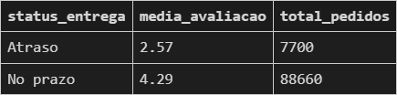
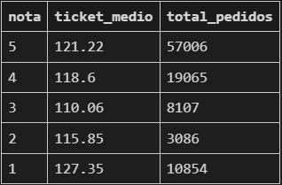
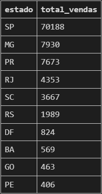
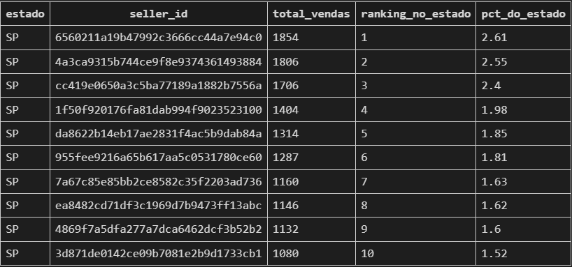

# 🛒 Olist E-commerce — Análise com SQL

## 📌 Sobre o projeto

Análise exploratória do dataset público da Olist, maior marketplace
brasileiro, utilizando SQL puro com SQLite. O projeto parte da definição
de hipóteses de negócio antes de qualquer query, valida ou refuta cada
hipótese com dados, e chega em conclusões acionáveis para o contexto
de e-commerce brasileiro.

**Dataset:** [Brazilian E-Commerce Public Dataset by Olist — Kaggle](https://www.kaggle.com/datasets/olistbr/brazilian-ecommerce)  
**Período dos dados:** setembro/2016 a outubro/2018  
**Volume:** 99.441 pedidos, 8 tabelas relacionadas

---

## 🗄️ Modelo de dados
```
orders ────────── order_items ──── products ── product_category
│ │
├── order_reviews └── sellers
├── order_payments
└── customers
```

---

## 🎯 Hipóteses investigadas

| Hipótese | Resultado |
|---|---|
| H1: cama_mesa_banho lidera em volume de vendas | ✅ Confirmada |
| H2: Atraso na entrega impacta negativamente a avaliação | ✅ Confirmada |
| H3: Produtos com avaliação baixa têm ticket médio maior | ⚠️ Parcial |
| H4: Vendedores de SP dominam em volume de vendas | ✅ Confirmada |

---

## 💡 Principais conclusões

**H1 — Categorias e receita**  
`cama_mesa_banho` lidera em volume (11.115 vendas), mas `beleza_saude`
gera mais receita total (R$ 1.258.681). O maior ticket médio pertence
a `pcs` (R$ 1.098) — volume e receita são métricas independentes e
devem ser analisadas separadamente.



**H2 — Impacto do atraso**  
Pedidos atrasados têm média de avaliação 2,57 vs 4,29 dos pontuais —
diferença de 1,72 pontos numa escala de 5. Com 7.700 pedidos atrasados
na amostra, o resultado é estatisticamente robusto. Pontualidade na
entrega é o fator mais crítico para satisfação do cliente.



**H3 — Ticket médio vs avaliação**  
A relação não é linear — o padrão encontrado foi em U: nota 1 tem o
maior ticket médio (R$ 127,35) e nota 5 o segundo maior (R$ 121,22).
Clientes que pagam mais têm expectativas mais altas: quando o produto
decepciona, a frustração é maior; quando agrada, a satisfação também.



**H4 — Concentração geográfica**  
SP lidera com 70.188 vendas — quase 9x mais que MG (2° lugar, 7.930).
Sudeste (SP+MG+RJ) representa ~82% do volume total. Apesar da
dominância do estado, nenhum vendedor individual supera 2,61% do
volume de SP — mercado extremamente pulverizado.



---

## 🌟 Query bônus — Window Functions

Ranking de vendedores dentro de cada estado com percentual de
participação, usando `RANK()` e `SUM() OVER (PARTITION BY)`



```sql
WITH vendas_por_vendedor AS (
    SELECT
        s.seller_state as estado,
        s.seller_id,
        COUNT(DISTINCT oi.order_id) as total_vendas
    FROM order_items oi
    JOIN sellers s ON oi.seller_id = s.seller_id
    GROUP BY s.seller_state, s.seller_id
)
SELECT
    estado,
    seller_id,
    total_vendas,
    RANK() OVER (PARTITION BY estado ORDER BY total_vendas DESC) as ranking_no_estado,
    ROUND(total_vendas * 100.0 / SUM(total_vendas) OVER (PARTITION BY estado), 2) as pct_do_estado
FROM vendas_por_vendedor
WHERE estado = 'SP'
ORDER BY ranking_no_estado
LIMIT 10;
```

---

## 🛠️ Tecnologias utilizadas

- SQL (SQLite)
- Python (apenas para importação dos CSVs)
- DB Browser for SQLite / VS Code

---

## 📁 Estrutura do projeto

```
├── data/
│ └── (CSVs do dataset Olist)
├── queries/
│ └── analise_olist.sql
├── scripts/
│ └── import_data.py
├── requirements.txt
└── README.md
```

---

## 🚀 Como executar

```bash
# 1. Clone o repositório
git clone https://github.com/AndreyFPichuti/olist-ecommerce-analysis.git

# 2. Instale as dependências
pip install -r requirements.txt

# 3. Importe os dados
python scripts/import_data.py

# 4. Abra o arquivo de queries no VS Code
# queries/analise_olist.sql
```

---

## ⚠ Aviso

Os CSVs não estão incluídos no repositório devido ao tamanho. 
Baixe o dataset diretamente no Kaggle mencionado aqui neste mesmo arquivo.

## 👤 Autor

Feito por **Andrey Ferreira Pichuti**  
[LinkedIn](https://www.linkedin.com/in/andrey-ferreira-pichuti-027298200/) • [GitHub](https://github.com/AndreyFPichuti)